# Getting started with coda.plot

`coda.plot` provides simple plots for exploring compositional data. In
this type of data, each row describes how a total is distributed among
several parts. For example, a mixture may consist of protein, fat, and
carbohydrates.

The most important requirement is that all parts must be **strictly
positive**. Rows do not need to sum to 1 or 100: the functions work with
relative proportions.

``` r
library(coda.plot)
#> Loading required package: coda.base
#> 
#> Attaching package: 'coda.base'
#> The following object is masked from 'package:stats':
#> 
#>     dist

set.seed(2026)
X <- matrix(rexp(90, rate = 1), ncol = 3)
colnames(X) <- c("Protein", "Fat", "Carbohydrates")
group <- factor(rep(c("Control", "Treatment"), each = 15))

head(X)
#>        Protein       Fat Carbohydrates
#> [1,] 0.3973469 0.7499553     0.3302451
#> [2,] 0.1130610 2.8804064     1.1843942
#> [3,] 1.5074140 0.2041778     2.1363013
#> [4,] 0.8360404 1.8247179     1.7945151
#> [5,] 0.1107380 0.3626434     1.8339835
#> [6,] 4.0741295 0.4318313     0.3468551
```

## A quick ternary diagram

When there are exactly three parts,
[`ternary_plot()`](https://mcomas.github.io/coda.plot/reference/ternary_plot.md)
is the most direct way to display them. Each point corresponds to a row
of `X`. A point closer to a vertex has a larger relative proportion of
the part shown at that vertex.

``` r
ternary_plot(X, group = group)
```

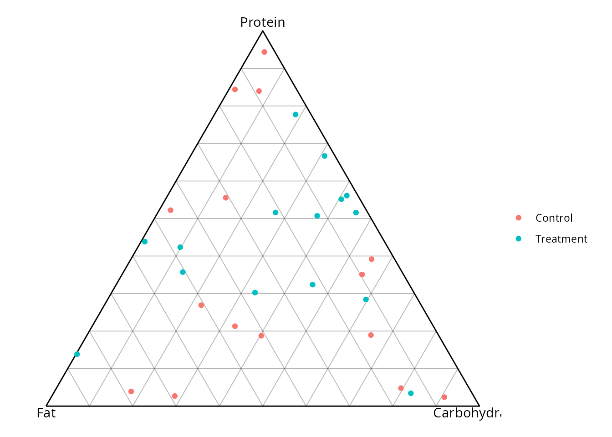

With `center = TRUE`, the plot is centred on the mean composition.
`scale = TRUE` standardises variability, while `show_pc = TRUE` adds the
first two principal directions of variation.

``` r
ternary_plot(X, group = group, center = TRUE, scale = TRUE, show_pc = TRUE)
```

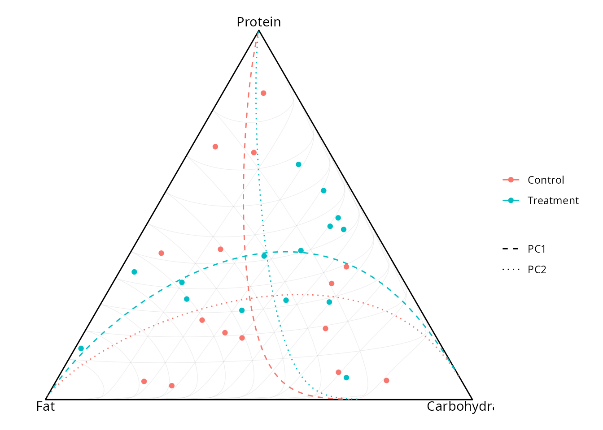

## Building a ternary diagram layer by layer

The modular interface is useful when you want to control each plot
element. First,
[`ternary_frame()`](https://mcomas.github.io/coda.plot/reference/ternary_frame.md)
defines the transformation and labels. Next,
[`ternary_base()`](https://mcomas.github.io/coda.plot/reference/ternary_base.md)
creates the triangle, and the `add_ternary_*()` functions add layers to
it.

``` r
frame <- ternary_frame(X, labels = c("P", "F", "C"))

p <- ternary_base(frame, show_grid = FALSE)
p <- add_ternary_grid(p, ticks = c(0.25, 0.50, 0.75), colour = "grey80")
#> Warning: Duplicated aesthetics after name standardisation: colour
#> Duplicated aesthetics after name standardisation: colour
#> Duplicated aesthetics after name standardisation: colour
p <- add_ternary_points(p, X, group = group, size = 2)
p
```

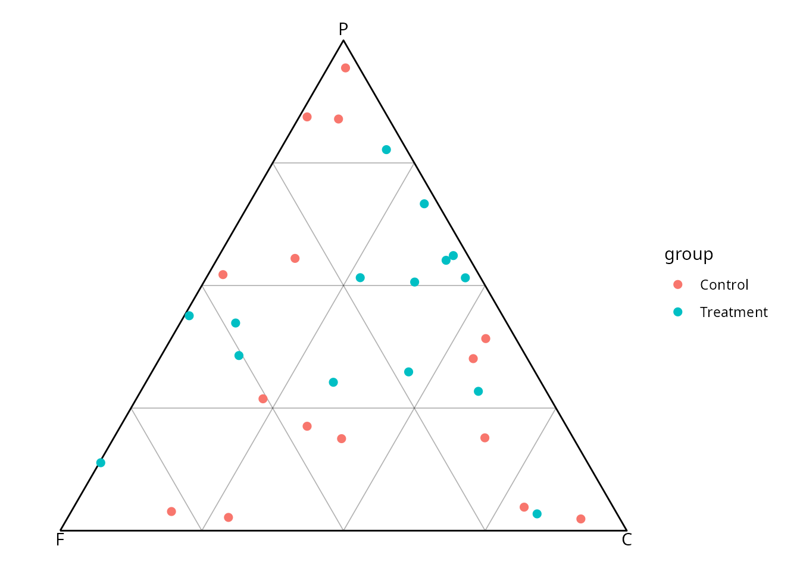

[`add_ternary_path()`](https://mcomas.github.io/coda.plot/reference/add_ternary_path.md)
joins ordered compositions. In this example, the path shows a gradual
transition from a protein-rich composition to a carbohydrate-rich
composition.

``` r
path <- rbind(
  c(8, 1, 1),
  c(6, 2, 2),
  c(4, 3, 3),
  c(2, 3, 5),
  c(1, 2, 7)
)

p <- ternary_base(ternary_frame(path, labels = colnames(X)))
p <- add_ternary_path(p, path, colour = "#0072B2", linewidth = 1)
add_ternary_points(p, path, colour = "#0072B2", size = 2)
```

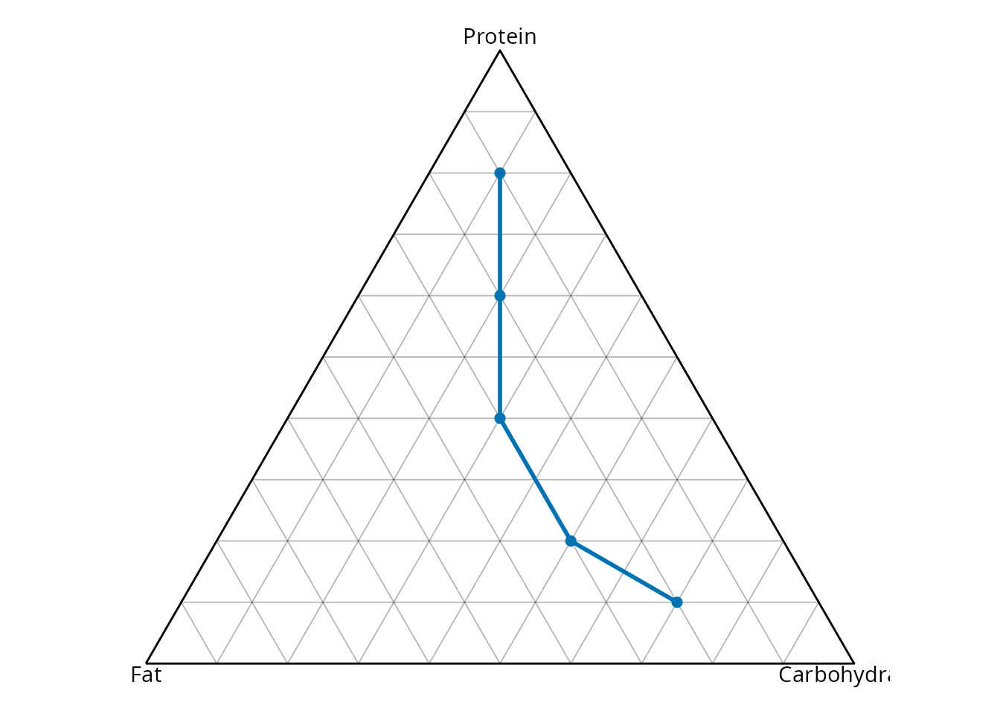

[`add_ternary_pc()`](https://mcomas.github.io/coda.plot/reference/add_ternary_pc.md)
adds principal directions manually. It is the modular equivalent of
`show_pc = TRUE`.

``` r
p <- ternary_base(ternary_frame(X, center = TRUE))
p <- add_ternary_points(p, X, group = group)
add_ternary_pc(p, X, colour = "black", linewidth = 0.7)
```

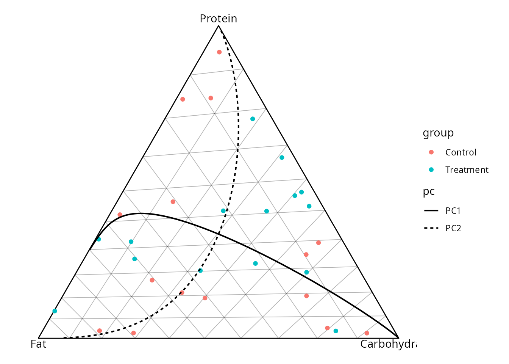

Finally,
[`ternary_coords()`](https://mcomas.github.io/coda.plot/reference/ternary_coords.md)
returns the coordinates used for plotting. This is useful for preparing
annotations or custom `ggplot2` layers.

``` r
coords <- ternary_coords(frame, X, group = group)
head(coords)
#>          c1        c2        c3         .A         .B         .C        .x
#> 1 0.3973469 0.7499553 0.3302451 0.26892332 0.50756770 0.22350898 0.3579706
#> 2 0.1130610 2.8804064 1.1843942 0.02706193 0.68944514 0.28349292 0.2970239
#> 3 1.5074140 0.2041778 2.1363013 0.39175049 0.05306223 0.55518728 0.7510625
#> 4 0.8360404 1.8247179 1.7945151 0.18765187 0.40956362 0.40278451 0.4966104
#> 5 0.1107380 0.3626434 1.8339835 0.04799329 0.15716776 0.79483896 0.8188356
#> 6 4.0741295 0.4318313 0.3468551 0.83953927 0.08898571 0.07147502 0.4912447
#>           .y   group
#> 1 0.23289442 Control
#> 2 0.02343632 Control
#> 3 0.33926588 Control
#> 4 0.16251129 Control
#> 5 0.04156340 Control
#> 6 0.72706234 Control
```

## Comparing groups with geometric means

[`geometric_mean_barplot()`](https://mcomas.github.io/coda.plot/reference/geometric_mean_barplot.md)
compares parts across groups. Bars represent deviations from the overall
mean; `include_boxplot = TRUE` also shows the variability among
observations.

``` r
geometric_mean_barplot(X, group, include_boxplot = TRUE)
```

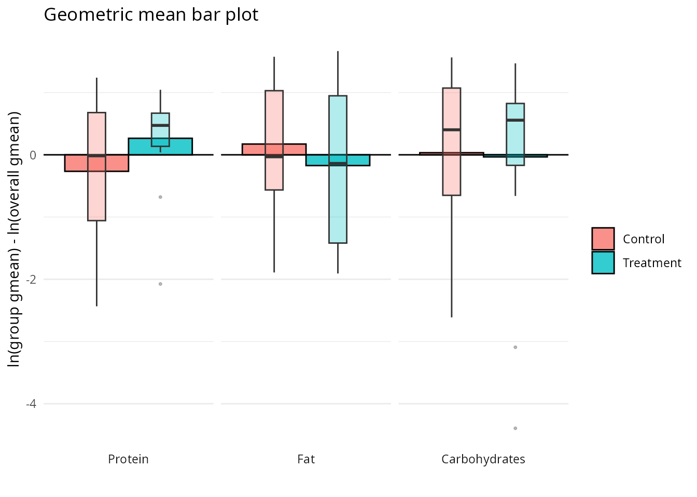

With `clr_scale = TRUE`, calculations use clr coordinates, which are
appropriate for interpreting relative differences among parts.

``` r
geometric_mean_barplot(X, group, clr_scale = TRUE)
```

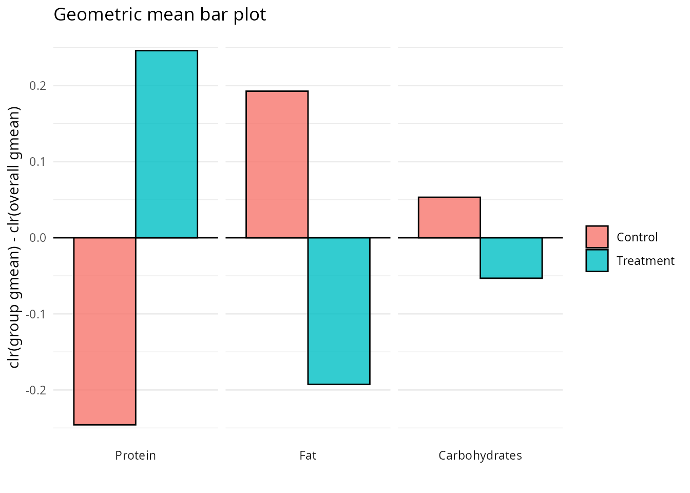

## CLR biplot

For compositions with three or more parts,
[`clr_biplot()`](https://mcomas.github.io/coda.plot/reference/clr_biplot.md)
summarises observations and parts in two dimensions. Nearby points
represent similar observations; label directions indicate which parts
explain the variation.

``` r
X6 <- matrix(rexp(180), ncol = 6)
colnames(X6) <- paste0("Part_", 1:6)
```

``` r
clr_biplot(X6, group = group)
#> Ignoring unknown labels:
#> • shape : ""
```

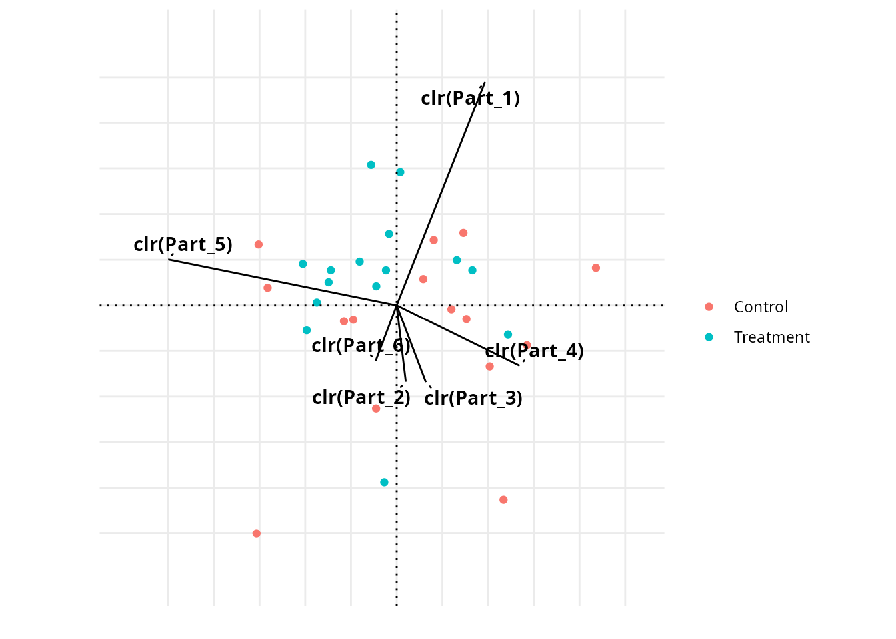

The `"covariance"` type emphasises observations, whereas `"form"` makes
relationships among parts easier to read.

``` r
clr_biplot(X6, group = group, biplot_type = "form")
#> Ignoring unknown labels:
#> • shape : ""
```

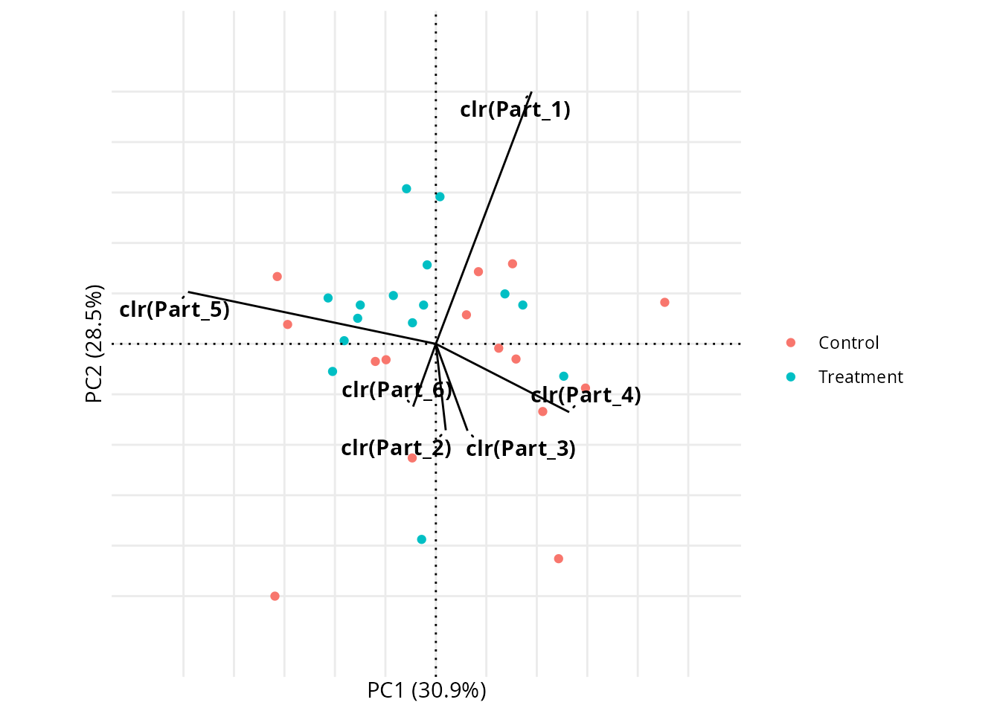

If you need to reuse the coordinates, `return_data = TRUE` returns the
observation data, variable data, and plot.

``` r
result <- clr_biplot(X6, group = group, return_data = TRUE)
names(result)
#> [1] "obs"  "vars" "plot"
```

## Log-contrast biplot

[`logcontrast_biplot()`](https://mcomas.github.io/coda.plot/reference/logcontrast_biplot.md)
displays observations according to two user-defined contrasts. Each
column of `lc` must sum to zero. Here, the first axis compares parts 1
and 2, while the second compares parts 3 and 4.

``` r
lc <- cbind(
  `Part 1 / Part 2` = c(1, -1, 0, 0, 0, 0),
  `Part 3 / Part 4` = c(0, 0, 1, -1, 0, 0)
)

logcontrast_biplot(X6, lc, group = group)
#> Ignoring unknown labels:
#> • shape : ""
```

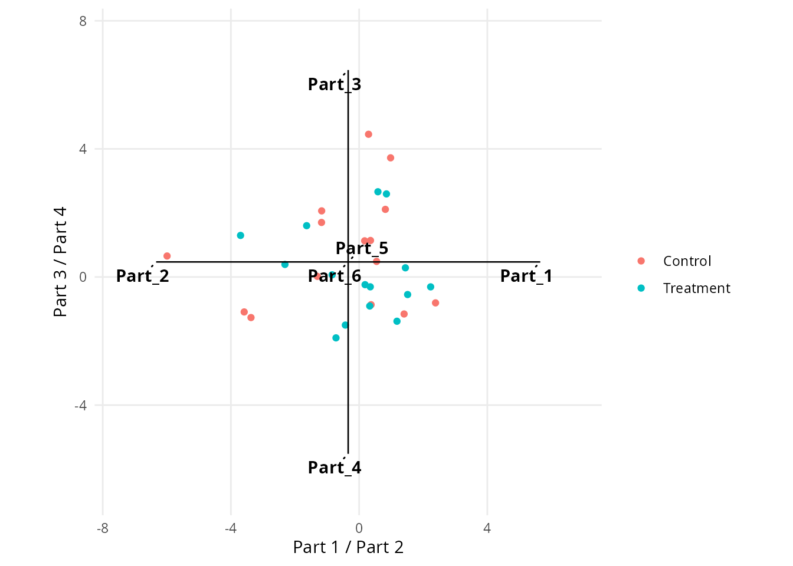

## Balance dendrogram

[`balance_dendrogram()`](https://mcomas.github.io/coda.plot/reference/balance_dendrogram.md)
helps interpret a balance basis. The `B` matrix describes which parts
are compared at each split. One can be generated automatically with
[`coda.base::pb_basis()`](https://mcomas.net/coda.base/reference/pb_basis.html).

``` r
B <- coda.base::pb_basis(X6, method = "exact")
balance_dendrogram(X6, B, group = group)
```

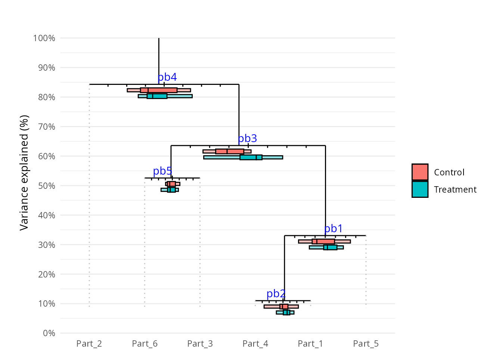

## Function summary

| Function | Main use |
|----|----|
| [`ternary_plot()`](https://mcomas.github.io/coda.plot/reference/ternary_plot.md) | Quickly create a complete ternary diagram. |
| [`ternary_frame()`](https://mcomas.github.io/coda.plot/reference/ternary_frame.md) | Define the ternary transformation and labels. |
| [`ternary_base()`](https://mcomas.github.io/coda.plot/reference/ternary_base.md) | Create the base triangle. |
| [`add_ternary_grid()`](https://mcomas.github.io/coda.plot/reference/add_ternary_grid.md) | Add grid lines. |
| [`add_ternary_points()`](https://mcomas.github.io/coda.plot/reference/add_ternary_points.md) | Add observations. |
| [`add_ternary_path()`](https://mcomas.github.io/coda.plot/reference/add_ternary_path.md) | Add a path of ordered compositions. |
| [`add_ternary_pc()`](https://mcomas.github.io/coda.plot/reference/add_ternary_pc.md) | Add principal component directions. |
| [`ternary_coords()`](https://mcomas.github.io/coda.plot/reference/ternary_coords.md) | Obtain coordinates for custom layers. |
| [`geometric_mean_barplot()`](https://mcomas.github.io/coda.plot/reference/geometric_mean_barplot.md) | Compare parts and groups with geometric means. |
| [`clr_biplot()`](https://mcomas.github.io/coda.plot/reference/clr_biplot.md) | Explore observations and parts in clr coordinates. |
| [`logcontrast_biplot()`](https://mcomas.github.io/coda.plot/reference/logcontrast_biplot.md) | Display two user-defined log-contrasts. |
| [`balance_dendrogram()`](https://mcomas.github.io/coda.plot/reference/balance_dendrogram.md) | Interpret a balance basis. |

To get started,
[`ternary_plot()`](https://mcomas.github.io/coda.plot/reference/ternary_plot.md)
is usually enough for three-part compositions, while
[`clr_biplot()`](https://mcomas.github.io/coda.plot/reference/clr_biplot.md)
is a good choice for higher-dimensional compositions. The remaining
functions offer more control or answer more specific questions.
